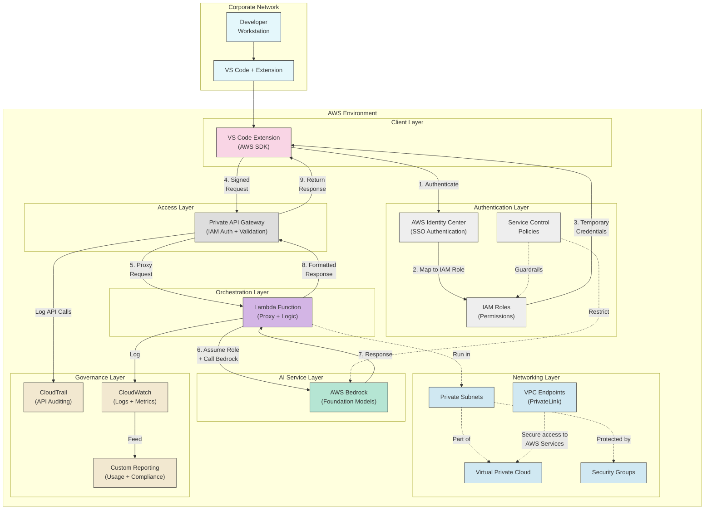
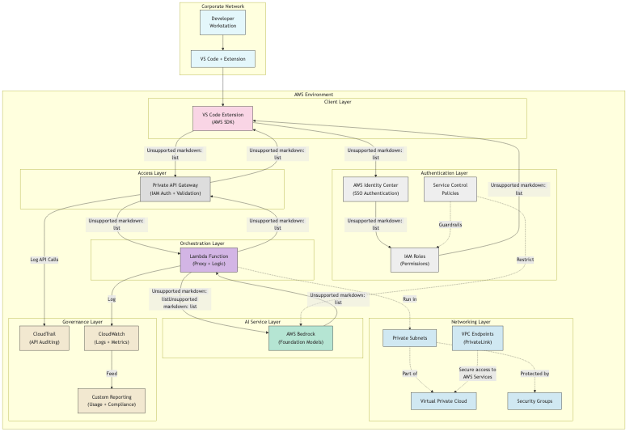

# Architecture Layers Diagram

## Layer Documentation

| Layer | Components | Purpose | Key Security Aspects |
|-------|------------|---------|---------------------|
| Client Layer | VS Code Extension | Interface for developers | Secure credential handling |
| Access/Control Layer | Private API Gateway | Secure entry point | IAM auth, request validation |
| Authentication Layer | AWS Identity Center, IAM | User identity and permissions | SSO, least privilege access |
| Orchestration Layer | Lambda Function | Request processing | Role assumption, validation |
| AI Service Layer | AWS Bedrock | LLM processing | Controlled model access |
| Networking Layer | VPC, Endpoints, Security Groups | Network isolation | Private connectivity |
| Governance Layer | CloudTrail, CloudWatch | Auditing and monitoring | Immutable logs, alerting |

## Mermaid Diagram

## Rendered Diagram Image

*Architecture Layers Diagram showing the architectural layers and components from developers to Bedrock*

## Layer Descriptions

### Client Layer
The Client Layer consists of the VS Code extension on the developer's workstation, which provides an interface for developers to interact with the AWS Bedrock LLMs. It handles authentication via AWS Identity Center and formats API requests.

### Authentication Layer
The Authentication Layer manages identity and access control through AWS Identity Center, IAM roles and permissions, and Service Control Policies (SCPs). It ensures only authorized developers can access the API and enforces least-privilege access.

### Access/Control Layer
The Access Layer provides a secure entry point through a private API Gateway. It enforces IAM authentication, validates requests against schemas, and implements throttling and resource policies.

### Orchestration Layer
The Orchestration Layer, implemented as a Lambda function, handles request processing, input validation, role assumption for Bedrock access, and logging. It acts as a critical security boundary and business logic processor.

### AI Service Layer
The AI Service Layer consists of AWS Bedrock, which provides access to foundation models. Access is restricted via IAM policies and SCPs, ensuring only approved models can be used.

### Networking Layer
The Networking Layer provides network isolation through a VPC, private subnets, security groups, and VPC endpoints (PrivateLink), ensuring traffic stays within the AWS network backbone and doesn't traverse the public internet.

### Governance Layer
The Governance Layer manages auditing and monitoring through CloudTrail (for API auditing), CloudWatch (for logs and metrics), and custom reporting solutions for usage tracking and compliance.
