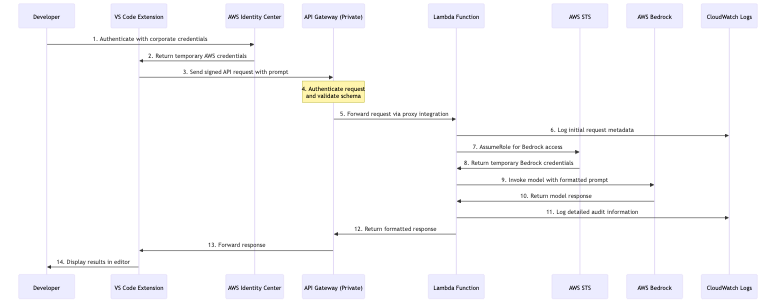

# Authentication and Request Flow Diagram

## Flow Documentation

| Step | Component | Action | Metadata | Notes |
|------|-----------|--------|----------|-------|
| 1 | Developer | Authenticate to AWS | Uses corporate credentials | Via AWS Identity Center |
| 2 | AWS Identity Center | Authenticate user | User identity validation | Verifies corporate credentials |
| 3 | AWS Identity Center | Issue temporary credentials | Short-lived AWS credentials | Maps to IAM role |
| 4 | VS Code Extension | Construct API request | Contains prompt & parameters | Signed with temp credentials |
| 5 | API Gateway | Validate request | Authentication & schema validation | Private endpoint via VPC |
| 6 | API Gateway | Forward request | Lambda proxy integration | Passes full request context |
| 7 | Lambda Function | Assume role | STS AssumeRole | For least-privilege access |
| 8 | Lambda Function | Invoke Bedrock | Call InvokeModel API | Via VPC endpoint |
| 9 | Bedrock | Process LLM request | Run inference | Foundation model processing |
| 10 | Bedrock | Return response | Model output | Sent back to Lambda |
| 11 | Lambda Function | Log & process response | Audit logging | Structured format for monitoring |
| 12 | Lambda Function | Return formatted response | HTTP 200 with JSON | Standardized response format |
| 13 | API Gateway | Forward response | Pass Lambda response | Back to VS Code extension |
| 14 | VS Code Extension | Display results | Show to developer | In editor interface |

## Mermaid Diagram

## Rendered Diagram Image

*Authentication and request flow diagram showing the path from developer to Bedrock models*
