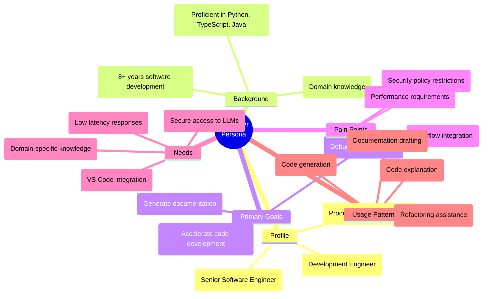
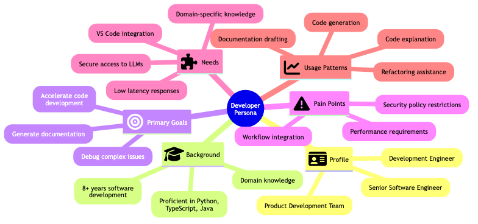
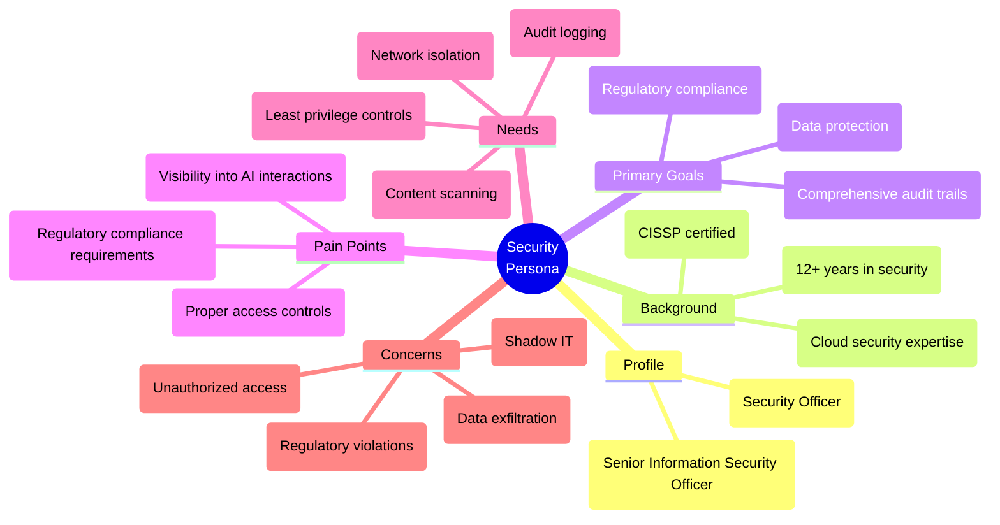
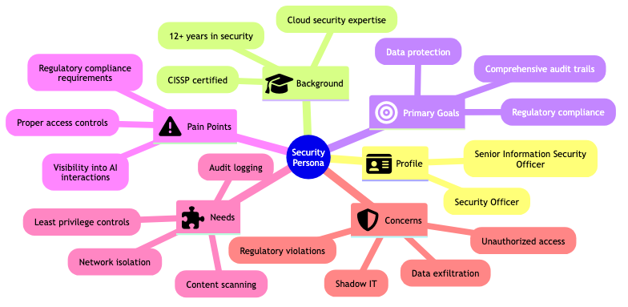
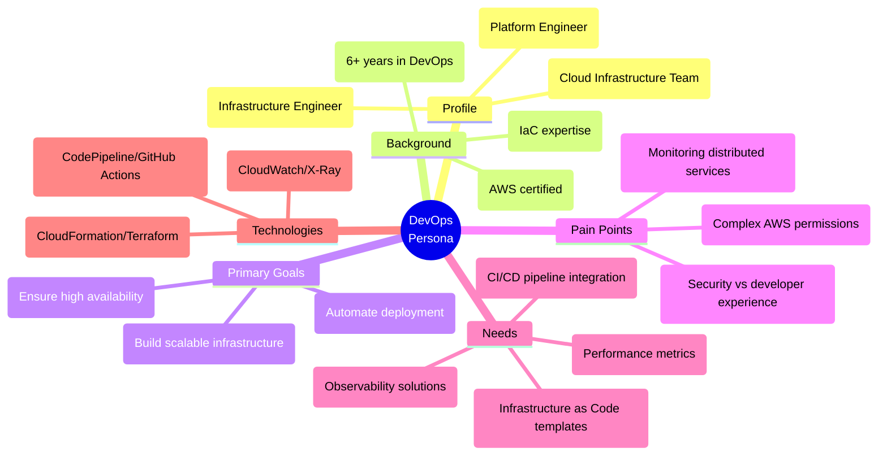
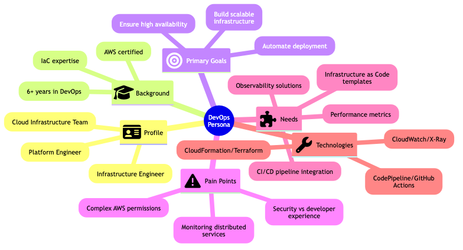

# Developer Persona Profiles

## Persona Documentation

| Persona | Role | Background | Goals | Pain Points |
|---------|------|------------|-------|-------------|
| Developer | Senior Software Engineer | 8+ years in development, Python, TypeScript, Java | Code assistance, documentation generation, debugging | Access to LLMs within security constraints |
| Security Team | InfoSec Officer | 12+ years in security, CISSP certified | Regulatory compliance, data protection, audit trails | Visibility, access controls, compliance |
| DevOps Team | Platform Engineer | 6+ years in DevOps, AWS certified | Infrastructure automation, monitoring, availability | Complex permissions, security vs usability |

## Developer Persona Diagram

## Rendered Diagram Image

*Developer Persona Profile showing key characteristics, goals and needs of software engineers using LLMs*

This diagram is defined in the Mermaid file [dev-persona.mmd](images/dev-persona.mmd) and rendered as [dev-persona.png](images/dev-persona.png).

## Security Team Persona Diagram

## Rendered Security Persona Diagram

*Security Persona Profile showing key characteristics, goals and needs of security professionals managing AI systems*

This diagram is defined in the Mermaid file [security-persona.mmd](images/security-persona.mmd) and rendered as [security-persona.png](images/security-persona.png).

## DevOps Team Persona Diagram

## Rendered DevOps Persona Diagram

*DevOps Persona Profile showing key characteristics, goals and needs of infrastructure engineers supporting AI systems*

This diagram is defined in the Mermaid file [devops-persona.mmd](images/devops-persona.mmd) and rendered as [devops-persona.png](images/devops-persona.png).

## Key Insights for Solution Design

### Developer Perspective
- The solution must be seamlessly integrated into VS Code, their primary IDE
- Authentication should be transparent, leveraging existing corporate credentials
- Performance is crucial – responses should be fast to maintain productivity
- Context retention is important for continuous assistance during development

### Security Team Perspective
- Complete audit trail of all interactions is non-negotiable
- Strict access controls based on job role/need
- Network isolation to prevent unauthorized data access
- Model access controls to limit capabilities as needed
- Compliance with regulatory requirements is mandatory

### DevOps Team Perspective
- Solution must be deployable via Infrastructure as Code
- Monitoring and alerting capabilities are essential
- Resource utilization and cost tracking features needed
- Clear documentation on operational aspects
- Ability to automate deployment pipelines
