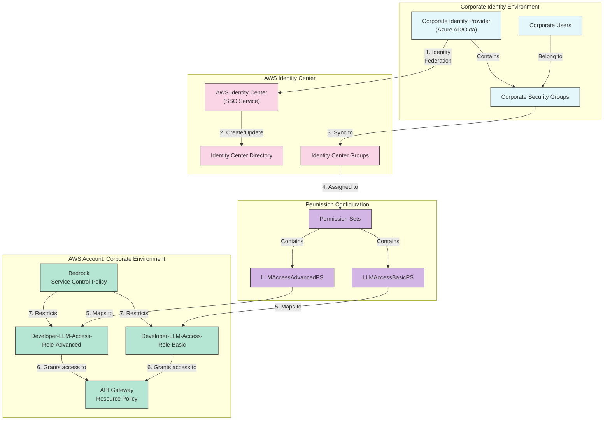
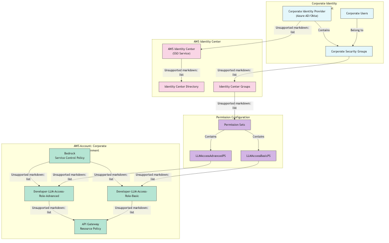

# Identity Center Configuration Diagram

## Configuration Documentation

| Component | Purpose | Configuration Details | Security Aspects |
|-----------|---------|------------------------|------------------|
| Corporate Identity Provider | Source of user identities | Azure AD, Okta, or other corporate IdP | Single source of truth for identities |
| Identity Center Directory | User/group synchronization | Syncs with corporate IdP | Automated user lifecycle management |
| User Groups | Logical grouping of users | e.g., Corp-LLM-Users-Basic, Corp-LLM-Users-Advanced | Role-based access control |
| Permission Sets | IAM permission templates | e.g., LLMAccessBasicPS, LLMAccessAdvancedPS | Standardized permission definitions |
| AWS Accounts | Isolated AWS environments | Development, Test, Production accounts | Environment separation |
| IAM Roles | AWS execution contexts | Developer-LLM-Access-Role-Basic, Developer-LLM-Access-Role-Advanced | Least privilege permissions |

## Mermaid Diagram



## Rendered Diagram Image


*Identity Center Configuration Diagram illustrating Identity Center integration with corporate identity provider and role mappings*

This diagram is defined in the Mermaid file [identity-center.mmd](images/identity-center.mmd) and rendered as [identity-center.png](images/identity-center.png).

## Identity Center Configuration Details

### 1. Directory Integration
- AWS Identity Center connects to the corporate identity provider (e.g., Azure AD, Okta)
- User attributes and group memberships are synchronized
- Authentication remains with the corporate IdP (SAML-based federation)

### 2. Group Mapping
- Corporate security groups map to Identity Center groups
- Examples:
  - `CorpSec-Dev-LLM-Basic` → `Corp-LLM-Users-Basic`
  - `CorpSec-Dev-LLM-Advanced` → `Corp-LLM-Users-Advanced`

### 3. Permission Sets
- `LLMAccessBasicPS`: Basic permission set that grants:
  - Access to execute-api:Invoke for basic models only
  - Limited token quotas and capabilities
- `LLMAccessAdvancedPS`: Advanced permission set that grants:
  - Access to execute-api:Invoke for all approved models
  - Higher token quotas and additional capabilities

### 4. Account Assignments
- Permission sets are assigned to specific AWS accounts
- User groups are mapped to permission sets
- This creates the IAM roles that users assume when accessing AWS resources

### 5. IAM Role Configuration
- `Developer-LLM-Access-Role-Basic`:
  ```json
  {
    "Version": "2012-10-17",
    "Statement": [{
      "Effect": "Allow",
      "Action": "execute-api:Invoke",
      "Resource": "arn:aws:execute-api:region:account-id:api-id/v1/invoke/basic-model-*"
    }]
  }
  ```
- `Developer-LLM-Access-Role-Advanced`:
  ```json
  {
    "Version": "2012-10-17",
    "Statement": [{
      "Effect": "Allow",
      "Action": "execute-api:Invoke",
      "Resource": "arn:aws:execute-api:region:account-id:api-id/v1/invoke/*"
    }]
  }
  ```

### 6. Service Control Policies
- Organization-level policies that restrict what actions can be performed regardless of IAM permissions
- Example SCP for Bedrock model restriction:
  ```json
  {
    "Version": "2012-10-17",
    "Statement": [{
      "Effect": "Deny",
      "Action": "bedrock:InvokeModel",
      "Resource": "*",
      "Condition": {
        "StringNotLike": {
          "bedrock:ModelId": [
            "amazon.titan-text-express-v1",
            "anthropic.claude-v2"
          ]
        }
      }
    }]
  }
  ```
