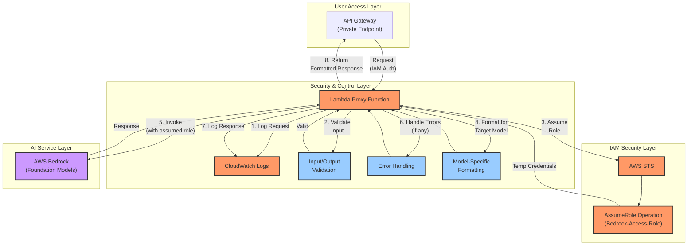
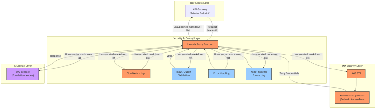

# Lambda Intermediary Role Diagram

## Role Documentation

| Function | Description | Security Aspect | Business Logic Aspect |
|----------|-------------|-----------------|----------------------|
| Security Boundary | Creates isolation between API Gateway and Bedrock | Prevents direct access to Bedrock | N/A |
| Role Assumption | Uses STS to assume dedicated Bedrock role | Follows least-privilege principle | N/A |
| Audit Trail | Logs detailed information about requests and responses | Creates clear evidence of who accessed what | Provides usage metrics and analytics |
| Input Validation | Validates inputs beyond schema validation | Prevents injection attacks | Ensures request quality |
| Model-Specific Formatting | Transforms requests to model-specific formats | N/A | Handles different model interfaces |
| Error Handling | Processes and standardizes errors | Hides internal errors from users | Provides meaningful error messages |
| Content Scanning | Optional scanning for sensitive data | Prevents PII leakage | Enforces content policies |

## Mermaid Diagram

## Rendered Diagram Image

*Lambda Intermediary Role Diagram illustrating the Lambda function's critical role as a security boundary and business logic processor*

## Benefits of Lambda Intermediary

1. **Security Isolation**
   * API Gateway cannot directly assume different IAM roles
   * Lambda creates a critical security boundary
   * Enables least-privilege permissions through role assumption
   * Creates clear audit trail of which entity accessed Bedrock

2. **Request/Response Processing**
   * Customized validation beyond API Gateway schema validation
   * Model-specific payload formatting for different LLM providers
   * Content filtering and PII detection (optional)
   * Standardized response formatting

3. **Operational Excellence**
   * Detailed structured logging for audit trails
   * Custom error handling and retry logic
   * Monitoring and alerting capabilities
   * Rate limiting and throttling options

4. **Client Simplification**
   * VS Code extension code remains simpler
   * Complex error handling centralized in Lambda
   * Consistent interface across multiple models
