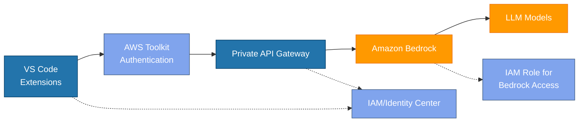

# VS Code to Bedrock Minimal Architecture

This diagram illustrates the minimal secure architecture connecting VS Code to Amazon Bedrock:

1. **VS Code Extensions** use the AWS Toolkit for authentication and connect to a Private API Gateway
2. **API Gateway** provides a secure endpoint that connects directly to Amazon Bedrock
3. **IAM/Identity Center** manages authentication and permissions throughout the flow
4. **Amazon Bedrock** processes LLM requests and returns responses to VS Code

The solid lines show the request flow, while dotted lines indicate authentication/permission relationships.

This design eliminates unnecessary components (like intermediate Lambda functions) while maintaining security through private connections, proper IAM controls, and API Gateway's direct service integration capabilities.
