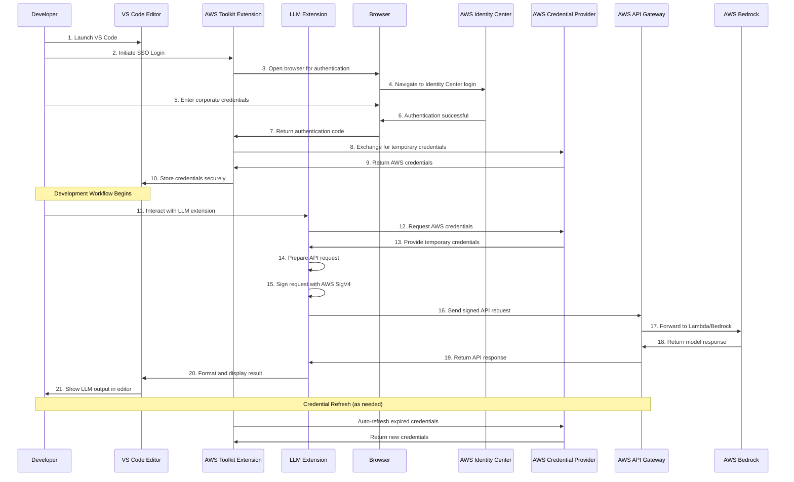
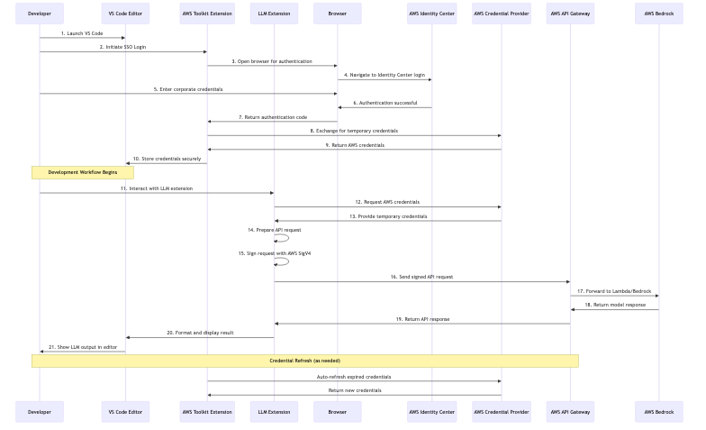

# VS Code Extension Integration Diagram

## Integration Flow Documentation

| Flow Step | Component | Action | Technical Detail |
|-----------|-----------|--------|------------------|
| 1 | Developer | Launch VS Code | IDE initialization |
| 2 | AWS Toolkit | Initiate SSO login | Using AWS SDK authentication APIs |
| 3 | Browser | Open Identity Center login | SAML-based authentication flow |
| 4 | Identity Center | Authenticate user | Validates corporate credentials |
| 5 | AWS Toolkit | Store temporary credentials | Short-lived AWS credentials in credential cache |
| 6 | LLM Extension | Access credentials | Uses AWS SDK credential provider chain |
| 7 | LLM Extension | Sign API request | SigV4 signing process |
| 8 | AWS API Gateway | Process request | Authentication, validation, and routing |
| 9 | VS Code UI | Display results | Rich text or syntax highlighted rendering |

## Mermaid Diagram



## Rendered Diagram Image


*VS Code Extension Integration Diagram showing VS Code extension integration with authentication flow and request handling*

This diagram is defined in the Mermaid file [vscode-ext.mmd](images/vscode-ext.mmd) and rendered as [vscode-ext.png](images/vscode-ext.png).

## VS Code Extension Components

### AWS Toolkit for VS Code
- **Purpose**: Provides authentication with AWS and credential management
- **Core Functions**:
  - Initiates the AWS SSO login flow
  - Securely manages temporary AWS credentials
  - Handles credential refresh
  - Provides AWS credential provider for other extensions

### LLM Extension
- **Purpose**: Enables developers to interact with AWS Bedrock LLMs
- **Core Functions**:
  - UI components for prompt input and response display
  - Credential acquisition from AWS Toolkit
  - API request construction and signing (SigV4)
  - Response formatting and rendering

## Authentication Flow Details

1. **Initial Authentication**:
   - Developer launches VS Code and initiates SSO login via AWS Toolkit
   - AWS Toolkit opens browser to Identity Center login page
   - After successful authentication, Identity Center returns a code
   - AWS Toolkit exchanges code for temporary credentials
   - Credentials are securely stored in local credentials cache

2. **Credential Provider Chain**:
   - LLM extension uses AWS SDK's default credential provider chain
   - Provider chain checks multiple sources for credentials:
     ```javascript
     // JavaScript example of credential resolution
     const credentialProviderChain = new AWS.CredentialProviderChain([
       () => new AWS.EnvironmentCredentials('AWS'),
       () => new AWS.EnvironmentCredentials('AMAZON'),
       () => new AWS.SharedIniFileCredentials({ profile: 'default' }),
       () => new AWS.ProcessCredentials({ profile: 'default' }),
       () => new AWS.SSOCredentials({ profile: 'default' }),
       () => new AWS.EC2MetadataCredentials(),
       () => new AWS.TokenFileWebIdentityCredentials(),
       () => new AWS.ECSCredentials()
     ]);
     ```
   - In this case, the SSOCredentials provider returns the credentials from AWS Toolkit

3. **Credential Refresh**:
   - Temporary credentials typically last 1-8 hours
   - AWS Toolkit handles automatic refresh when possible
   - If refresh fails, user is prompted to re-authenticate

## API Interaction Details

1. **Request Preparation**:
   ```javascript
   // Example request construction
   const request = {
     method: 'POST',
     path: `/v1/invoke/${modelId}`,
     headers: {
       'Content-Type': 'application/json',
     },
     body: JSON.stringify({
       prompt: "Explain this code: function hello() { return 'world'; }",
       temperature: 0.7,
       max_tokens: 1000
     })
   };
   ```

2. **Request Signing (AWS SigV4)**:
   ```javascript
   // Example of AWS Signature Version 4 signing
   const signer = new AWS.Signers.V4(request, 'execute-api');
   signer.addAuthorization(credentials, new Date());
   ```

3. **Response Handling**:
   ```javascript
   // Example response processing
   try {
     const response = await fetch(request);
     const data = await response.json();
     
     // Format and display in VS Code UI
     vscode.window.activeTextEditor.edit((editBuilder) => {
       // Insert at current cursor position
       const position = vscode.window.activeTextEditor.selection.active;
       editBuilder.insert(position, data.generated_text);
     });
   } catch (error) {
     vscode.window.showErrorMessage(`API Error: ${error.message}`);
   }
   ```

## Security Considerations

1. **Credential Handling**:
   - Credentials are never stored in extension code or settings
   - All credential management is delegated to AWS Toolkit
   - Credentials are short-lived and automatically rotated

2. **Request Security**:
   - All requests are signed with AWS SigV4
   - All communication uses HTTPS (TLS 1.2+)
   - API Gateway validates signatures and permissions
   
3. **Extension Permissions**:
   - Extension requests minimal VS Code permissions
   - No file system access beyond what's needed for operation
   - Clear separation between AWS Toolkit (authentication) and LLM Extension (functionality)
