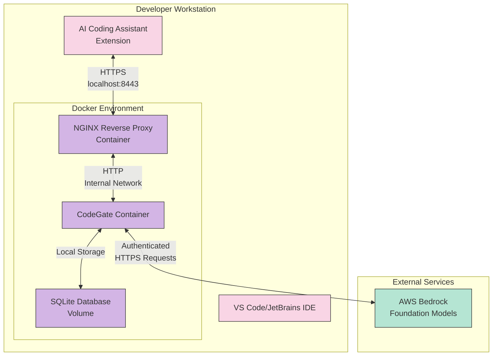
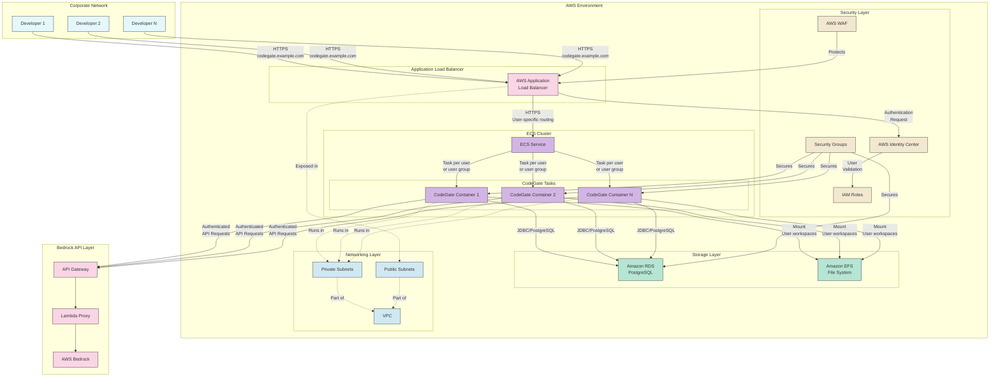
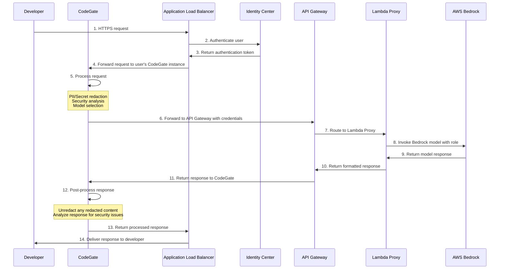

# CodeGate Integration Design: Phase 2 Implementation

## Overview

This document outlines the architecture and implementation plan for integrating CodeGate into our existing AWS Bedrock architecture. CodeGate is a security-focused gateway for AI applications and coding assistants that provides enhanced security features, workspace management, and model routing capabilities.

Two implementation patterns will be provided:
1. **Local Developer Setup**: Docker-based deployment for individual developer workstations
2. **AWS Production Implementation**: Scalable multi-user implementation integrated with our existing AWS Bedrock architecture

## Background

[CodeGate](https://github.com/stacklok/codegate) is an open-source tool that acts as a security gateway between AI coding assistants and foundation models. It provides:

- **Security Analysis**: Scans AI-generated code for security issues
- **Workspace Management**: Isolated development spaces with separate histories and configurations
- **Model Muxing**: Routes requests to different AI models based on workspaces or file types
- **Secrets/PII Redaction**: Prevents sensitive information from being sent to AI models
- **Dependency Risk Awareness**: Identifies outdated or vulnerable packages in suggestions
- **Request Audit Trail**: Logs all interactions for security compliance

## Implementation Challenges

The primary implementation challenges include:
1. CodeGate doesn't natively support SSL/TLS, requiring secure proxy solutions
2. Integration with our existing AWS Identity Center authentication system
3. Supporting multi-user environments with isolated workspaces
4. Ensuring high performance and availability in the AWS deployment
5. Maintaining security for data in transit and at rest

## Deployment Pattern 1: Local Developer Docker Setup

### Architecture



### Components

1. **CodeGate Container**:
   - Based on the official `ghcr.io/stacklok/codegate:latest` image
   - Configured to connect to AWS Bedrock APIs
   - Stores data in a persistent Docker volume

2. **NGINX Reverse Proxy**:
   - Terminates SSL/TLS connections
   - Provides HTTPS endpoint for AI coding assistants
   - Routes traffic to CodeGate container via internal Docker network

3. **SQLite Database**:
   - Persistent Docker volume for CodeGate data
   - Stores workspaces, configurations, and audit logs

### Implementation Steps

1. **Create Docker Compose File**:
   ```yaml
   version: '3.8'
   services:
     codegate:
       image: ghcr.io/stacklok/codegate:latest
       volumes:
         - codegate_volume:/app/codegate_volume
       environment:
         - CODEGATE_LOG_LEVEL=info
         - CODEGATE_WORKSPACE_DEFAULT=bedrock
       ports:
         - "8989:8989"  # API port (internal only)
         - "8990:8990"  # API compatibility port (internal only)
       restart: unless-stopped
       networks:
         - codegate-network

     nginx:
       image: nginx:alpine
       volumes:
         - ./nginx.conf:/etc/nginx/nginx.conf:ro
         - ./ssl:/etc/nginx/ssl:ro
       ports:
         - "8443:443"  # HTTPS port
         - "9090:9090"  # Dashboard port
       depends_on:
         - codegate
       restart: unless-stopped
       networks:
         - codegate-network

   volumes:
     codegate_volume:

   networks:
     codegate-network:
       driver: bridge
   ```

2. **Create NGINX Configuration**:
   ```nginx
   worker_processes 1;

   events {
     worker_connections 1024;
   }

   http {
     server {
       listen 443 ssl;
       server_name localhost;

       ssl_certificate /etc/nginx/ssl/cert.pem;
       ssl_certificate_key /etc/nginx/ssl/key.pem;
       ssl_protocols TLSv1.2 TLSv1.3;
       ssl_ciphers HIGH:!aNULL:!MD5;

       location / {
         proxy_pass http://codegate:8989;
         proxy_http_version 1.1;
         proxy_set_header Upgrade $http_upgrade;
         proxy_set_header Connection "upgrade";
         proxy_set_header Host $host;
         proxy_set_header X-Real-IP $remote_addr;
         proxy_set_header X-Forwarded-For $proxy_add_x_forwarded_for;
         proxy_set_header X-Forwarded-Proto $scheme;
       }
     }

     server {
       listen 9090;
       server_name localhost;

       location / {
         proxy_pass http://codegate:9090;
         proxy_http_version 1.1;
         proxy_set_header Host $host;
         proxy_set_header X-Real-IP $remote_addr;
         proxy_set_header X-Forwarded-For $proxy_add_x_forwarded_for;
         proxy_set_header X-Forwarded-Proto $scheme;
       }
     }
   }
   ```

3. **Generate Self-Signed SSL Certificate**:
   ```bash
   mkdir -p ssl
   openssl req -x509 -nodes -days 365 -newkey rsa:2048 \
     -keyout ssl/key.pem -out ssl/cert.pem \
     -subj "/C=US/ST=State/L=City/O=Organization/CN=localhost"
   ```

4. **Configure CodeGate for AWS Bedrock**:
   - Create config file with AWS Bedrock model configurations
   - Set up AWS credentials for API access

5. **Create User Setup Script**:
   ```bash
   #!/bin/bash
   
   # Check if Docker is installed
   if ! command -v docker &> /dev/null; then
     echo "Docker is not installed. Please install Docker first."
     exit 1
   fi

   # Create necessary directories
   mkdir -p codegate/ssl

   # Generate self-signed SSL certificate
   openssl req -x509 -nodes -days 365 -newkey rsa:2048 \
     -keyout codegate/ssl/key.pem -out codegate/ssl/cert.pem \
     -subj "/C=US/ST=State/L=City/O=Organization/CN=localhost"

   # Copy configuration files
   cp nginx.conf codegate/
   cp docker-compose.yml codegate/
   cp bedrock-config.yaml codegate/config.yaml
   
   # Start the containers
   cd codegate
   docker-compose up -d
   
   echo "CodeGate is now running!"
   echo "Dashboard: http://localhost:9090"
   echo "API Endpoint: https://localhost:8443"
   ```

### Usage Instructions for Developers

1. Run the setup script to deploy CodeGate locally
2. Configure your AI coding assistant to use `https://localhost:8443` as the API endpoint
3. Accept the self-signed certificate when prompted
4. Access the CodeGate dashboard at `http://localhost:9090`

## Deployment Pattern 2: AWS Multi-User Implementation

### Architecture



### Components

1. **Application Load Balancer (ALB)**:
   - Terminates SSL/TLS connections
   - Routes traffic to specific CodeGate containers based on user identity
   - Integrates with AWS WAF for additional security

2. **Amazon ECS Service**:
   - Manages CodeGate containers (tasks) running on Fargate
   - Ensures high availability and scalability
   - Supports auto-scaling based on demand

3. **CodeGate Containers**:
   - One container or container group per user/team
   - Configured with user-specific credentials and settings
   - Connected to centralized PostgreSQL database

4. **Amazon RDS PostgreSQL**:
   - Replaces SQLite with enterprise-grade database
   - Stores CodeGate configurations, workspace data, and audit logs
   - Multi-AZ deployment for high availability

5. **Amazon EFS**:
   - Shared file system for CodeGate workspace data
   - Persists data even if containers are restarted
   - Allows for backup and disaster recovery

6. **AWS Identity Center Integration**:
   - Authenticates users before allowing access to CodeGate
   - Maps corporate identities to specific CodeGate instances
   - Enforces role-based access controls

7. **Networking and Security**:
   - VPC with public and private subnets
   - Security groups to restrict traffic flows
   - AWS WAF to protect against common attacks

### Implementation Steps

1. **Create Infrastructure as Code (CloudFormation or Terraform)**:
   - Define VPC, subnets, security groups
   - Set up load balancer and target groups
   - Configure RDS PostgreSQL and EFS file systems
   - Create ECS cluster and service definitions

2. **Customize CodeGate for Multi-User Support**:
   - Modify Docker image to use PostgreSQL instead of SQLite
   - Create initialization script for user-specific configurations
   - Ensure proper isolation between user workspaces

3. **Set Up User Authentication Flow**:
   - Configure ALB authentication with AWS Identity Center
   - Create forwarding rules based on user identity
   - Ensure each user's traffic reaches their designated CodeGate instance

4. **Implement SSL/TLS Security**:
   - Use AWS Certificate Manager for TLS certificates
   - Configure ALB to terminate HTTPS connections
   - Ensure HTTPS for all communication paths

5. **Create User Management System**:
   - Develop scripts for provisioning new users
   - Implement user deprovisioning process
   - Monitor usage and manage resources

6. **Integration with Existing Bedrock Architecture**:
   - Configure CodeGate to authenticate with API Gateway
   - Set up proper IAM roles for Lambda proxy access
   - Ensure consistent model access patterns

### CloudFormation Template Excerpt (Key Components)

```yaml
Resources:
  # VPC and Networking
  CodeGateVPC:
    Type: AWS::EC2::VPC
    Properties:
      CidrBlock: 10.0.0.0/16
      EnableDnsSupport: true
      EnableDnsHostnames: true
      Tags:
        - Key: Name
          Value: CodeGate-VPC

  # Database
  CodeGateDatabase:
    Type: AWS::RDS::DBInstance
    Properties:
      Engine: postgres
      DBInstanceClass: db.t3.medium
      AllocatedStorage: 20
      StorageType: gp2
      MultiAZ: true
      DBName: codegate
      MasterUsername: !Sub '{{resolve:secretsmanager:${CodeGateDBSecret}:SecretString:username}}'
      MasterUserPassword: !Sub '{{resolve:secretsmanager:${CodeGateDBSecret}:SecretString:password}}'
      VPCSecurityGroups:
        - !GetAtt CodeGateDBSecurityGroup.GroupId
      DBSubnetGroupName: !Ref CodeGateDBSubnetGroup

  # EFS Storage
  CodeGateFileSystem:
    Type: AWS::EFS::FileSystem
    Properties:
      PerformanceMode: generalPurpose
      Encrypted: true
      FileSystemTags:
        - Key: Name
          Value: CodeGate-EFS

  # Load Balancer
  CodeGateLoadBalancer:
    Type: AWS::ElasticLoadBalancingV2::LoadBalancer
    Properties:
      Type: application
      Scheme: internet-facing
      SecurityGroups:
        - !GetAtt CodeGateALBSecurityGroup.GroupId
      Subnets:
        - !Ref PublicSubnet1
        - !Ref PublicSubnet2
      IpAddressType: ipv4

  # ECS Cluster
  CodeGateCluster:
    Type: AWS::ECS::Cluster
    Properties:
      ClusterName: CodeGateCluster
      CapacityProviders:
        - FARGATE
      DefaultCapacityProviderStrategy:
        - CapacityProvider: FARGATE
          Weight: 1

  # ECS Task Definition
  CodeGateTaskDefinition:
    Type: AWS::ECS::TaskDefinition
    Properties:
      Family: codegate
      Cpu: '512'
      Memory: '1024'
      NetworkMode: awsvpc
      RequiresCompatibilities:
        - FARGATE
      ExecutionRoleArn: !GetAtt CodeGateECSExecutionRole.Arn
      TaskRoleArn: !GetAtt CodeGateECSTaskRole.Arn
      ContainerDefinitions:
        - Name: codegate
          Image: ghcr.io/stacklok/codegate:latest
          Essential: true
          PortMappings:
            - ContainerPort: 8989
              HostPort: 8989
            - ContainerPort: 9090
              HostPort: 9090
          Environment:
            - Name: CODEGATE_DB_CONNECTION
              Value: !Sub 'postgresql://${CodeGateDatabase.Endpoint.Address}:${CodeGateDatabase.Endpoint.Port}/codegate'
            - Name: CODEGATE_ENABLE_AUDIT_LOG
              Value: 'true'
          MountPoints:
            - SourceVolume: codegate-data
              ContainerPath: /app/codegate_volume
              ReadOnly: false
          LogConfiguration:
            LogDriver: awslogs
            Options:
              awslogs-group: !Ref CodeGateLogGroup
              awslogs-region: !Ref AWS::Region
              awslogs-stream-prefix: codegate
      Volumes:
        - Name: codegate-data
          EFSVolumeConfiguration:
            FilesystemId: !Ref CodeGateFileSystem
            TransitEncryption: ENABLED
            AuthorizationConfig:
              IAM: ENABLED
```

### User Isolation Strategy

For each user or group of users:

1. **Dedicated CodeGate ECS Task**:
   - Separate ECS task with user-specific configuration
   - Isolated CodeGate process with its own database connection

2. **Partitioned Database Access**:
   - Row-level security in PostgreSQL
   - Each user only sees their own data

3. **Isolated EFS Directories**:
   - User-specific directory in the EFS filesystem
   - IAM-based access controls to prevent cross-user access

4. **Load Balancer Routing**:
   - Cognito/Identity Center authentication
   - Header-based routing to direct users to their CodeGate instance

### Security Measures

1. **Data in Transit**:
   - TLS 1.2+ for all external connections
   - VPC endpoints for AWS service connections
   - Private subnets for CodeGate containers

2. **Data at Rest**:
   - Encrypted EFS volumes
   - Encrypted RDS database
   - KMS keys with strict access controls

3. **Authentication & Authorization**:
   - AWS Identity Center SSO integration
   - IAM roles with least privilege
   - Request signing for AWS API calls

4. **Network Security**:
   - Security groups with minimal required access
   - WAF rules to protect against common attacks
   - VPC Flow Logs for network monitoring

## Integration with Existing Bedrock Architecture

The CodeGate implementation integrates with our existing AWS Bedrock architecture as follows:



## Implementation Phases

### Phase 1: Local Developer Setup (2 weeks)

1. **Week 1**:
   - Develop Docker Compose configuration
   - Create NGINX reverse proxy setup
   - Test integration with Bedrock API

2. **Week 2**:
   - Develop user setup scripts
   - Create documentation
   - Test with multiple AI assistants

### Phase 2: AWS Infrastructure Setup (3 weeks)

1. **Week 1**:
   - Deploy core VPC and network infrastructure
   - Set up RDS and EFS
   - Configure ALB and WAF

2. **Week 2**:
   - Deploy ECS cluster and service
   - Customize CodeGate for PostgreSQL
   - Test basic deployment

3. **Week 3**:
   - Integrate with Identity Center
   - Set up user routing
   - Configure monitoring and logging

### Phase 3: User Isolation and Production Launch (3 weeks)

1. **Week 1**:
   - Implement user isolation strategy
   - Test multi-user scenarios
   - Optimize performance

2. **Week 2**:
   - Perform security assessment
   - Develop operational procedures
   - Create user onboarding process

3. **Week 3**:
   - Conduct final testing
   - Prepare training materials
   - Roll out to initial user group

## Operational Considerations

### Monitoring and Logging

- CloudWatch dashboards for ECS, RDS, and ALB metrics
- Centralized logging for CodeGate containers
- Alerts for security events and performance issues

### Backup and Disaster Recovery

- Automated RDS snapshots
- EFS backup to S3
- Multi-AZ deployment for critical components

### Cost Estimation

| Component | Monthly Cost (Est.) |
|-----------|---------------------|
| ECS Fargate (10 tasks) | $350-$450 |
| RDS PostgreSQL | $200-$300 |
| EFS Storage | $50-$150 |
| Application Load Balancer | $25-$50 |
| Data Transfer | $20-$100 |
| **Total** | **$645-$1,050** |

## Conclusion

This design provides two implementation patterns for CodeGate:

1. A lightweight Docker-based setup for individual developers
2. A scalable AWS implementation supporting multiple users

Both patterns address the key challenges of secure communication, user isolation, and integration with the existing Bedrock architecture. The AWS implementation leverages managed services to provide high availability, scalability, and security.

## Next Steps

1. Finalize resource requirements and cost estimates
2. Begin implementation of local developer setup
3. Create detailed AWS CloudFormation or Terraform templates
4. Develop user onboarding and operational procedures
